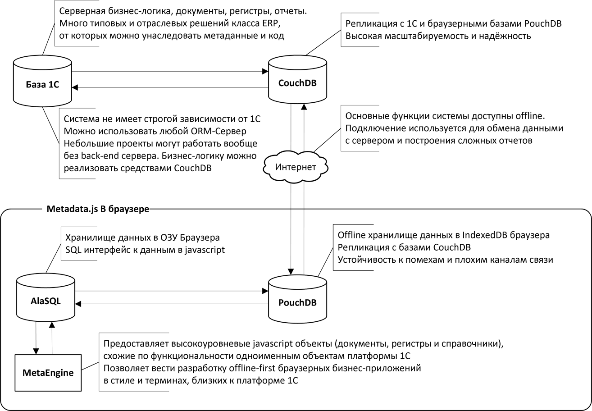
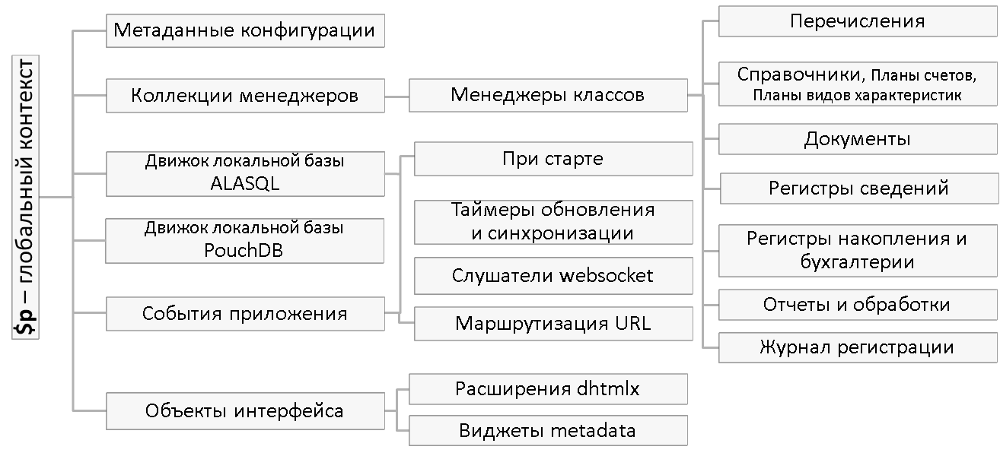

[](https://github.com/oknosoft/metadata.js/stargazers)
[](https://github.com/oknosoft/metadata.js/releases)
[](https://npmjs.org/package/metadata-js?)
[](https://en.wikipedia.org/wiki/MIT_License)

**Metadata.js** is a library for building offline-first browser-based applications

[README in Russian](README.md)

### Offline-first web application - it's just
- [helloworld repo](https://github.com/oknosoft/helloworld)
- [live demo](https://light.oknosoft.ru/helloworld/)

### What is Metadata.js?
**Metadata.js** is a JavaScript implementation of [1C:Enterprise Platform object model](http://1c-dn.com/1c_enterprise/platform_architecture_overview/). Its goal is to emulate the most popular classes of 1C:Enterprise API, while running in the browser or in Node.js.






### Unlike competitors
Metadata.js not compete with client Web UI and client-server (including reactive) frameworks, and complements the new abstraction of [data objects](http://www.oknosoft.ru/upzp/apidocs/classes/DataObj.html) and [data managers](http://www.oknosoft.ru/upzp/apidocs/classes/DataManager.html). Using these classes simplifies the development of complex interfaces of business applications.

## Install

```bash
npm install --save metadata-js  # node
npm install -g metadata-js      # command line
```

To create a folder and files structure, run the command
```bash
metadata init                   # create empty repo
npm install                     # install dependencies
```

For the browser, include:
```html
<link rel="stylesheet" type="text/css" href="//cdn.jsdelivr.net/npm/font-awesome@latest/css/font-awesome.min.css">
<link rel="stylesheet" type="text/css" href="//cdn.jsdelivr.net/combine/npm/metadata-js/dist/dhx_terrace.min.css,npm/metadata-js/dist/metadata.min.css">
<script src="//cdn.jsdelivr.net/combine/npm/moment,npm/alasql,npm/pouchdb,npm/jquery,npm/metadata-js/dist/dhtmlx.min.js,npm/metadata-js/dist/metadata.min.js"></script>
```

### Credits
Many thanks to
- Andrey Gershun & M. Rangel Wulff, authors of [AlaSQL](https://github.com/agershun/alasql) - Javascript SQL database library
- Authors of [PouchDB](http://pouchdb.com/) and [CouchDB](http://couchdb.apache.org/) - NoSQL database and data synchronization engine
- Other people for useful tools, which make our work easier

### License
[MIT](LICENSE)

The license on this repo covers all contents of the repo, but does not supercede the existing licenses for products used for this work and other products.

(c) 2014-2018, Oknosoft Lab (info@oknosoft.ru)
